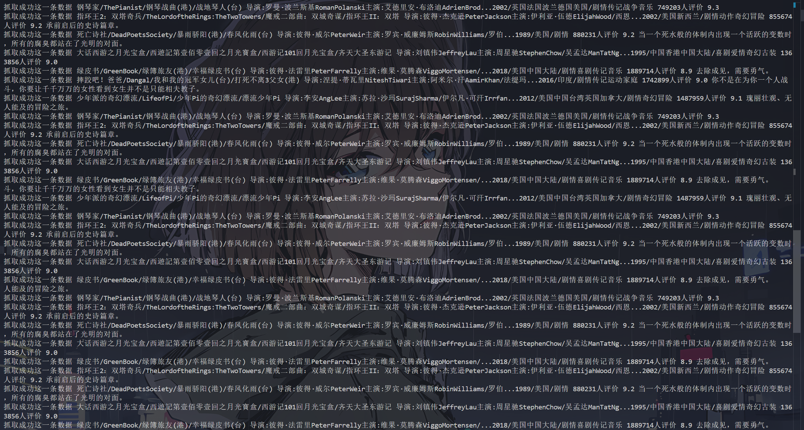
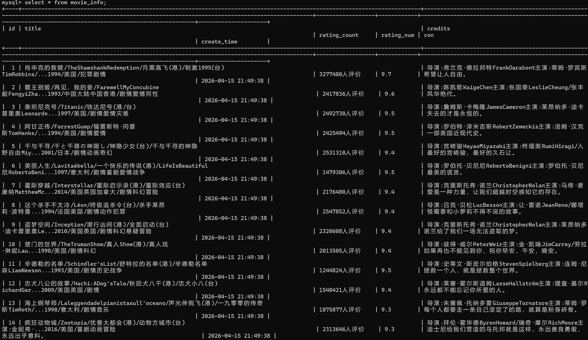

# 豆瓣 Top250 数据采集系统

## 项目简介
本项目是一个模块化python爬虫，用于采集豆瓣电影top250的影片信息，并持久化存储到MYSQL数据库中。本项目采用工程化设计，将配置管理，数据抓取，数据存储解耦为独立板块。

## 技术栈
- 语言:python 3
- 请求库:requests
- 解析库:lxml(xpath)
- 数据库:mysql+python
- 反爬策略:user-agent伪装轮换+随机请求间隔
  
## 项目结构
```
├── config.py #配置文件(数据库连接，请求头，爬取页数)
├── spider.py #页面与数据解析模块
├── storage.py #数据库初始化与数据存储模块
├── main.py #程序入口，调度抓取与存储流程
├── requirements.txt #项目依赖清单
└── README.md #项目文档说明
```

## 怎么开始

### 1.环境准备

```bash
# 克隆项目
git clone https://github.com/ty153/python_spider_lab

# 安装依赖
pip install -r requirements.txt

```

### 2.配置数据库
- 确保本地 MySQL 服务已启动,修改 config.py 中的数据库连接信息：
  
```python
CONFIG_MYSQL = {
    'host': 'localhost',
    'user': 'root',
    'password': '你的密码',
    'database': 'douban',      # 库名可自定义
    'charset': 'utf8mb4'
}
---
### 3.运行项目

```bash
python main.py
```

### 4.查看结果

```sql
USE douban;
SELECT * FROM movie_info LIMIT 10;
```

## 结果展示
| 运行过程                  | 数据库结果                 |
| ------------------------- | -------------------------- |
|  |  |

## 数据字段说明
- 字段	说明	示例
- title	影片标题	肖申克的救赎
- credits	演职员信息	导演：弗兰克·德拉邦特...
- rating_count	评价人数	2638559人评价
- rating_num	评分	9.7
- con	短评/引言	希望让人自由

## 踩坑记录

1. 模块间数据传递：通过函数返回值（字典列表）实现 `spider.py` 与 `storage.py` 的解耦数据传递

2. PyMySQL 语法细节：`pymysql.connect()` 容易漏写 `.connect`，`cursor.execute()` 容易拼写错误，需仔细检查

3. 数据库连接管理：`commit()` 和 `close()` 应放在循环外，避免重复操作导致连接断开

4. 初始化时机：`database_init()` 只需在程序启动时执行一次，放在循环内会造成资源浪费

5. 去重计数逻辑：使用 `affected_rows` 判断是否真正插入，避免 `INSERT IGNORE` 跳过的数据被误计

6. f-string 引号冲突：外层用双引号、内层用单引号，避免 Python 解析错误

## 核心设计

### 模块化架构
- config.py:统一管理配置，修改参数无需修改业务代码
- spider.py:专注于数据抓取与解析，返回标准化字典列表
- storage.py:自动及建立数据库，封装数据库操作
- main.py:调度各模块，包含异常处理与礼貌爬取延时

### 数据库去重
- 通过mysql的 `UNIQUE` 约束对 `title` 字段建立唯一索引
- 配合 `INSERT IGNORE` 语句实现幂等入库
- 使用 `affected_rows` 精确统计实际插入数量

### 反爬策略
- User-Agent 伪装，模拟浏览器请求
- 随机请求间隔（1-3 秒），降低请求频率

## 联系我
- 邮箱：3152057034@qq.com
- GitHub：https://github.com/ty153/python_spider_lab
- 博客：待更新