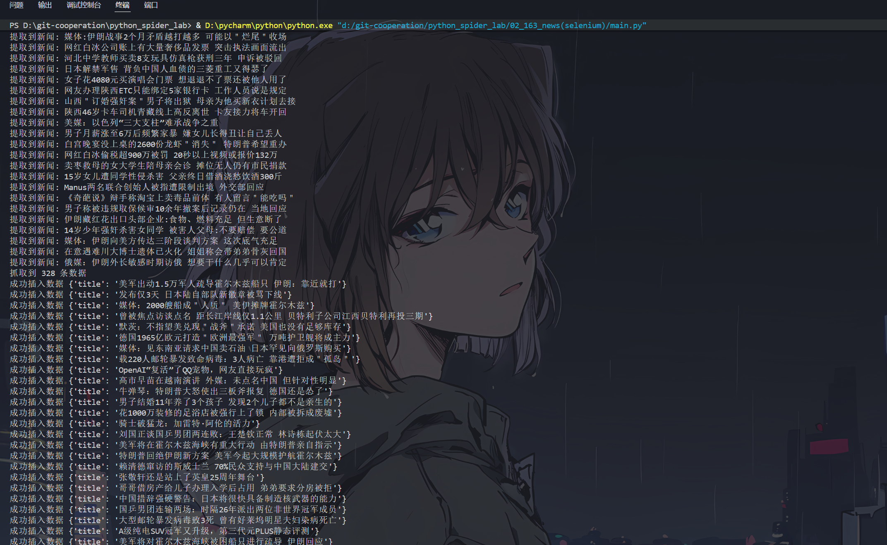
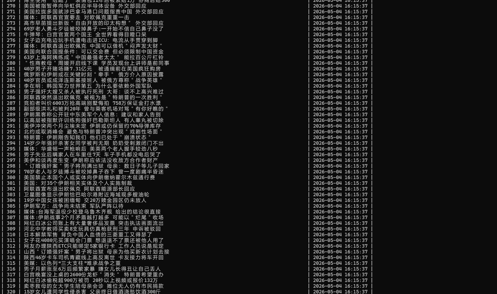

# 网易新闻动态加载数据采集系统

## 项目简介
本项目是一个模块化python爬虫，用于采集网易新闻首页动态记载新闻的标题信息，并持久化存储到MYSQL数据库中。项目采用selenium无头浏览器模拟用户滚动和点击操作，工程化设计延用豆瓣项目，将配置管理，数据抓取，数据存储解耦为独立板块。

## 技术栈
- 语言:python 3
- 动态抓取:selenium
- 解析库:lxml(xpath)
- 数据库:mysql+pymysql
- 反爬策略:User-Agent 伪装 + 无头模式 + 自动化特征隐藏
  
## 项目结构
```
├── config.py #配置文件(数据库连接，请求头，爬取页数)
├── spider.py #无头浏览器创建、页面加载、数据解析
├── storage.py #数据库初始化与数据存储模块
├── main.py #程序入口，调度抓取与存储流程
├── requirements.txt #项目依赖清单
└── README.md #项目文档说明
```

## 怎么开始

### 1.环境准备

```bash
# 克隆项目
git clone https://github.com/ty153/python_spider_lab

# 进入项目目录
cd python_spider_lab/02_163_news(selenium)

# 安装依赖
pip install -r requirements.txt

```

### 2.配置数据库
- 确保本地 MySQL 服务已启动,修改 config.py 中的数据库连接信息：
  
```python
CONFIG_MYSQL = {
    'host': 'localhost',
    'user': 'root',
    'password': '你的密码',
    'database': 'wangyi_news_selenium',      # 库名可自定义
    'charset': 'utf8mb4'
}
```
### 3.运行项目

```bash
python main.py
```

### 4.查看结果

```sql
USE wangyi_news_selenium;
SELECT * FROM new_titles LIMIT 10;
```

## 结果展示
| 运行过程                  | 数据库结果                 |
| ------------------------- | -------------------------- |
|  |  |

## 数据字段说明
| 字段  | 说明     | 示例                                              |
| ----- | -------- | ------------------------------------------------- |
| title | 新闻标题 | 俄媒：伊朗外长敏感时期访俄 想要干什么几乎可以肯定 |


## 踩坑记录

1. 按钮定位失败：最初使用文本匹配（`contains(text(), '加载更多')`）定位按钮失败，改为复制浏览器开发者工具中的绝对路径 XPath 后成功定位。

2. .strip() 报错：XPath 的 text() 返回列表而非字符串，直接调用 .strip() 报错。通过 title_list[0].strip() 取第一个元素解决。

3. 页面高度判断失灵：仅靠高度变化判断加载完成可能导致误判，加入按钮查找失败后的额外等待逻辑确保数据完整性。

4. 存储模块复用：从豆瓣项目复制 storage.py 时，发现只需修改 config.py 中的 TABLE_NAME 和 TABLE_COLUMNS 即可适配新项目，验证了通用模块设计的可行性。

## 核心设计

### 模块化架构
- config.py:统一管理配置，修改参数无需修改业务代码
- spider.py:专注于数据抓取与解析，返回标准化字典列表
- storage.py:自动及建立数据库，封装数据库操作
- main.py:调度各模块，包含异常处理与礼貌爬取延时

### 动态数据加载
- 使用 Selenium 无头浏览器模拟真实用户操作
- 滚动页面触发内容加载，JS 点击"加载更多"按钮
- 通过页面高度变化判断是否已加载全部内容
- 配置自动化特征隐藏（--disable-blink-features=AutomationControlled）

### 通用储存模块(跨项目)
- storage.py 不包含任何业务字段，所有字段信息从 config.py 的 TABLE_COLUMNS 字典动态读取
- 建表 SQL 和插入 SQL 均自动生成，换项目只需修改 config.py，存储层代码零改动
- 通过 data.get(field, '') 安全取值，避免字段缺失导致程序崩溃

### 反爬策略
- 无头模式减少资源利用
- 隐藏自动化特征
- User-Agent轮换,模仿多浏览器访问
- 随机访问间隔，模拟人类节奏

## 联系我
- 邮箱：3152057034@qq.com
- GitHub：https://github.com/ty153/python_spider_lab
- 博客：待更新