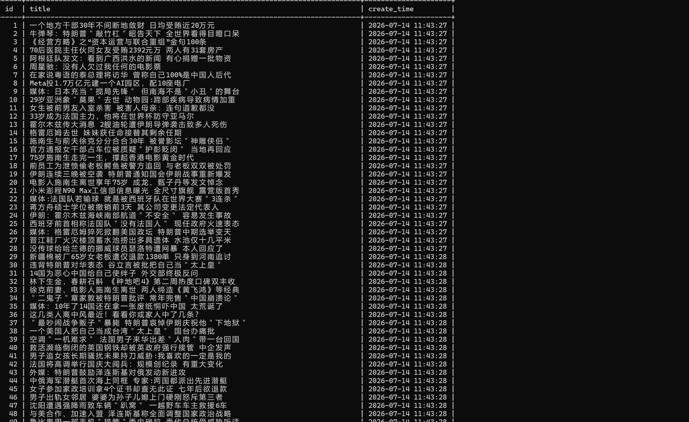

# Scrapy框架实战：网易新闻动态页面采集

## 项目介绍
本项目是一个`python`模块化爬虫，用于采集网易新闻首页动态加载的新闻标题。本项目采用`Scrapy`框架结合`selenium`实现数据自动化数据获取，保留之前所写的通用存储模块`storage.py`进行数据自动化存储。工程化沿用之前项目，`Scrapy`框架就是让数据采集、数据解析、数据存储进行解耦。

## 技术栈
- 语言:python 3
- 动态抓取:selenium
- 解析库:lxml(xpath)
- 数据库:mysql+pymysql
- 框架:Scrapy
- 反爬策略:User-Agent 伪装 + 无头模式 + 自动化特征隐藏

## 项目结构
```
04_scrapy_wangyi/
├── scrapy.cfg # Scrapy项目配置文件
├── requirements.txt # 项目依赖清单
├── README.md # 项目文档说明
└── news_scrapy/
├── spiders/
│ └── new.py # 爬虫逻辑（Spider）
├── items.py # 数据字段定义（Item）
├── pipelines.py # 数据管道（Pipeline，调用通用存储）
├── middlewares.py # 下载中间件（Selenium集成 + UA轮换）
├── settings.py # 项目配置（含数据库配置）
└── storage.py # 通用存储模块（跨项目复用）
```

## 怎么开始

### 1.环境准备

```bash
# 克隆项目
git clone https://github.com/ty153/python_spider_lab

# 进入项目目录
cd python_spider_lab/04_scrapy_wangyi

# 安装依赖
pip install -r requirements.txt

```

### 2.配置数据库
- 确保本地 MySQL 服务已启动,修改 config.py 中的数据库连接信息：
  
```python
CONFIG_MYSQL = {
    'host': 'localhost',
    'user': 'root',
    'password': '你的密码',
    'database': 'wangyi_news_selenium',      # 库名可自定义
    'charset': 'utf8mb4'
}

```
### 3.配置ChromeDriver路径
修改news_scrapy/middlewares.py中第45行左右的chromedriver.exe路径为你本机实际路径：
```python
service = Service(r'你的chromedriver路径')
```

### 4.运行项目

```bash
scrapy crawl new
```

### 5.查看结果

```sql
USE wangyi_news_scrapy;
SELECT * FROM new_titles LIMIT 10;
SELECT COUNT(*) FROM new_titles;  -- 查看总数据量
```

| 运行过程                  | 数据库结果                 |
| ------------------------- | -------------------------- |
|  |  |

## 数据字段说明
| 字段  | 说明     | 示例                                              |
| ----- | -------- | ------------------------------------------------- |
| title | 新闻标题 | 媒体：格雷厄姆猝死掀翻美国政坛 特朗普中期选举变天 |

## 核心设计

### Scrapy + Selenium 中间件集成
- Downloader Middleware（NewsScrapyDownloaderMiddleware），在process_request方法中拦截请求
- 使用Selenium无头浏览器加载页面，完成滚动和点击“加载更多”操作
- 将渲染后的完整HTML包装为HtmlResponse返回给Spider，实现动态页面的框架化采集
- 通过from_crawler类方法确保WebDriver在整个爬虫生命周期中只初始化一次，避免资源浪费
- 通过spider_closed信号在爬虫关闭时自动清理WebDriver资源

### 批量入库优化
- Pipeline收集所有Item，按批次（100条/批）调用通用存储模块
- 避免逐条入库带来的频繁连接开销，大幅提升写入效率
- 爬虫结束时统一处理剩余数据，确保不遗漏

### 通用存储模块（跨项目、跨框架复用）
- storage.py不包含任何业务字段，所有字段信息从settings.py的TABLE_COLUMNS字典动态读取
- 建表SQL和插入SQL均自动生成，换项目只需修改配置，存储层代码零改动
- 通过data.get(field, '')安全取值，避免字段缺失导致程序崩溃
- 经过三个手写模块化项目验证，本次首次在Scrapy框架中成功复用

### 数据库去重和反爬策略
- 通过MySQL的UNIQUE约束对title字段建立唯一索引
- 配合INSERT IGNORE语句实现幂等入库
- 无头模式减少资源消耗
- 隐藏自动化特征（--disable-blink-features=AutomationControlled）

## 踩坑记录
1. 按钮定位失败：网易新闻“加载更多”按钮在固定路径找不到，使用//*[contains(text(),"加载更多")]全标签查找
2. WebDriver重复初始化：最初将WebDriver初始化写在__init__中，每次请求都创建新实例导致内存过度消耗。改用from_crawler类方法确保全局唯一实例。
3. 数据逐条入库效率低：Pipeline最初每条Item调用一次save_to_mysql，导致频繁建立连接。改为列表收集+批量入库（100条/批），效率大幅提升。
4. 通用存储模块跨框架适配：从手写项目复制storage.py后，发现导入路径需要从config改为news_scrapy.settings，验证了通用模块的灵活性——只需修改一行导入即可适配新框架。
   

## 联系我
- 邮箱：tycrawler@outlook.com
- GitHub：https://github.com/ty153/python_spider_lab
- 博客：https://juejin.cn/user/3264922756579880